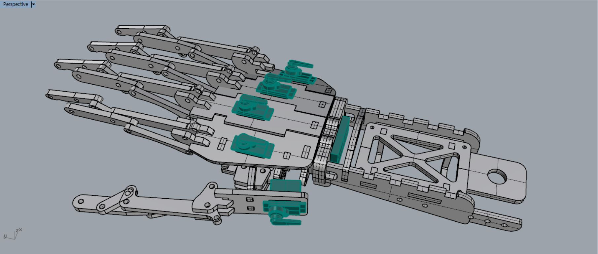

# Open Arms Low cost & Mass supply Project #

##  - Purpose ##

**OPENARMS MK.3**

Our team(Team LIMB) always try to make prosthetic arms for everyone can make low cost and easy. This is our 3rd model. We received a Grand prize in Probono Mentoring Final Contest hosted by KFICT(The Korea Federation of ICT Organizations).

## - Features ##

- Designed Considering Mechanical Mechanism
- 5 finger Servos, 1 Palm Servo
- Can use Android Bluetooth APP for Management EMG Sensor Value(Not include this repo)
- Used Laser Cutter for fast Production
- Used Encoder Switch for Variable Motions
- Used Bluno NANO for Bluetooth Application (https://github.com/DFRobot/BlunoBasicDemo - you can make your own android app for this prosthetic arm using this sample app)

## - Requirements

#### Hardware

* Bluno Nano
* Servo Motor (Gotech-SER0011 x 5ea)
* Li-Po Battery 2 cells(7.4V) 1300mAh
* Encoder Switch
* EMG Sensor (MyoWare Muscle Sensor - SEN-13723 - SparkFun Electronics)

#### Software

* Arduino IDE

## - Directory
| Sources              | Explanation                           |
| -------------------- | ------------------------------------- |
| `control_system.ino` | MK.3 main system .ino code directory. |
| `motor_test.ino`     | motor test code directory.            |

## - Installation

**Step 1** : Clone this repository.

**Step 2** : Contact us and get design asset. You should design your own PCB board. There is no available circuit design now.

**Step 3** : Assemble all parts and upload `control_system` code in Bluno Nano.

## Contact to Team LIMB

Any questions and contribution about our project are welcome!

Please contact us!

Ethan Kim : 4artit@gmail.com (System Architecture Design, Software & Hardware Design and Develop)

WonJae Ji : jiwi1005@gmail.com (Product Design,  Mechanical Mechanism Design)

